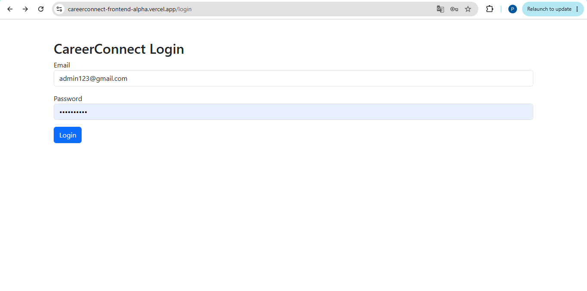
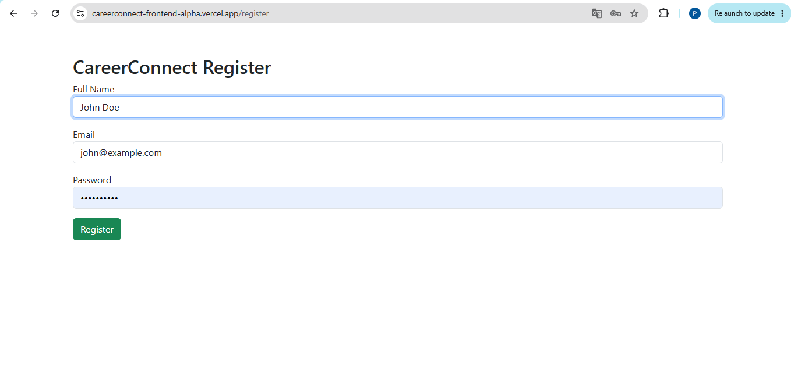
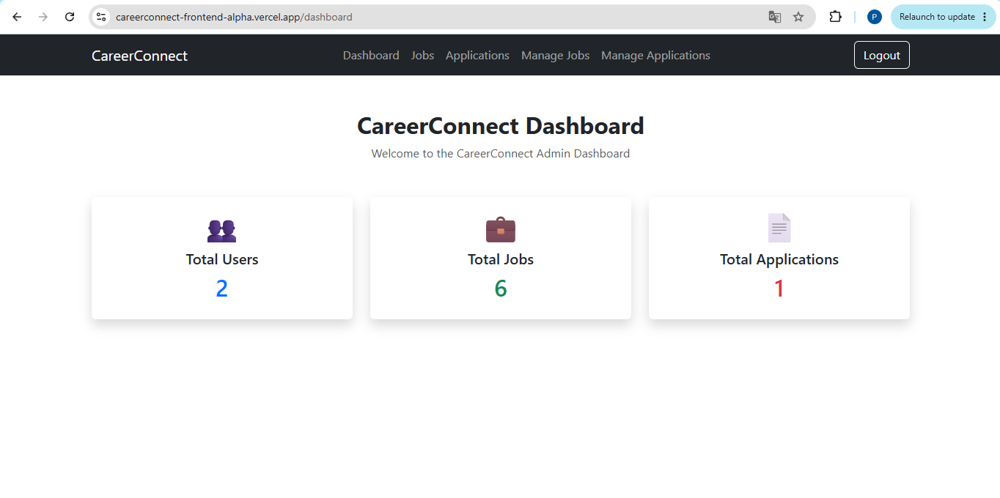
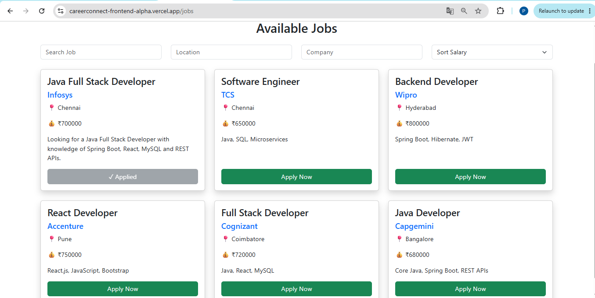
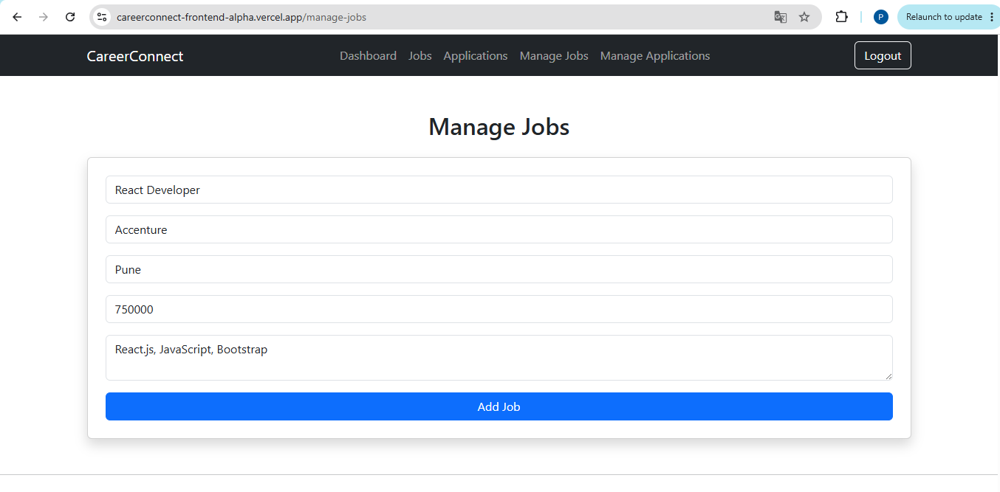
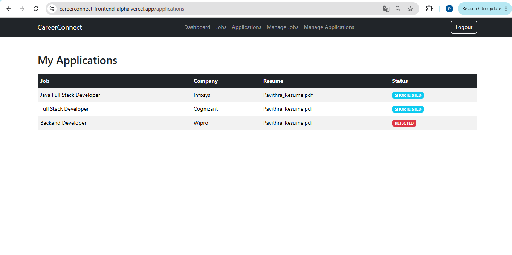
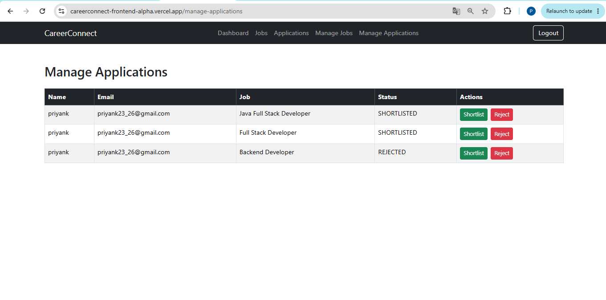

# 💼 CareerConnect – Full Stack Job Portal

CareerConnect is a Full Stack Job Portal built using **React**, **Spring Boot**, **Spring Security**, **JWT Authentication**, and **PostgreSQL**. It enables candidates to search and apply for jobs while allowing administrators to manage job postings and applications through a secure authentication system.

---

# 🚀 Live Demo

### Frontend (Vercel)

https://careerconnect-frontend-alpha.vercel.app

### Backend API (Render)

https://careerconnect-backend-ruxq.onrender.com

> **Note:** The backend is a REST API and does not provide a browser interface. It is consumed by the React frontend.

---

# ✨ Features

## Authentication

- User Registration
- Secure Login with JWT Authentication
- Protected Routes
- Logout

## Candidate

- Browse Available Jobs
- Search Jobs
- View Job Details
- Apply for Jobs
- Track Application Status

## Admin

- Add New Jobs
- Delete Jobs
- View All Applications
- Shortlist Candidates
- Reject Applications

---

# 🛠️ Technologies Used

## Frontend

- React.js
- React Router
- Axios
- Bootstrap 5

## Backend

- Java 21
- Spring Boot
- Spring Security
- Spring Data JPA
- JWT Authentication
- REST APIs

## Database

- PostgreSQL (Neon)

## Deployment

- Frontend: Vercel
- Backend: Render

## Tools

- Eclipse IDE
- VS Code
- Maven
- Git
- GitHub
- Postman

---

# 📸 Screenshots

### Login



---

### Register



---

### Dashboard



---

### Available Jobs



---

### Manage Jobs



---

### My Applications



---

### Manage Applications



---

# 📂 Project Structure

## Frontend

```
src
│
├── components
├── pages
├── services
├── App.jsx
└── main.jsx
```

## Backend

```
src/main/java
│
├── controller
├── service
├── repository
├── entity
├── security
├── config
└── dto
```

---

# ⚙️ Installation

## Clone the repositories

### Frontend

```bash
git clone https://github.com/Pavithra110/careerconnect-frontend.git
```

### Backend

```bash
git clone https://github.com/Pavithra110/careerconnect-backend.git
```

---

## Backend Setup

Configure your database in `application.properties` or use environment variables.

Example:

```properties
SPRING_DATASOURCE_URL=
SPRING_DATASOURCE_USERNAME=
SPRING_DATASOURCE_PASSWORD=
```

Run the Spring Boot application.

---

## Frontend Setup

Install dependencies

```bash
npm install
```

Run

```bash
npm run dev
```

---

# 📌 API

The frontend communicates with the backend using REST APIs.

Base URL

```
https://careerconnect-backend-ruxq.onrender.com/api
```

---

# 🔒 Security

- JWT Authentication
- Spring Security
- Password Encryption
- Protected API Endpoints

---

# 🚀 Future Enhancements

- Edit Job Functionality
- Resume Upload
- Email Notifications
- Company Profiles
- Profile Picture Upload
- Advanced Job Filtering
- Admin Dashboard Analytics

---

# 🔗 Related Repository

### Backend Repository

https://github.com/Pavithra110/careerconnect-backend

---

# 👩‍💻 Author

**Pavithra C**

GitHub

https://github.com/Pavithra110


